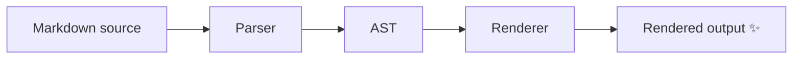

# Markdown Rendering Stress Test 🧪

> A deliberately varied document for testing editing, parsing, syntax highlighting,
> wrapping, concealment, navigation, Unicode handling, and rendered output.

## Table of contents

1. [Inline formatting](#inline-formatting)
2. [Headings](#headings)
3. [Paragraphs and line breaks](#paragraphs-and-line-breaks)
4. [Lists](#lists)
5. [Blockquotes](#blockquotes)
6. [Links and images](#links-and-images)
7. [Code](#code)
8. [Tables](#tables)
9. [Unicode](#unicode)
10. [Emoji](#emoji)
11. [Escaping and entities](#escaping-and-entities)
12. [HTML](#html)
13. [Footnotes](#footnotes)
14. [Definitions and abbreviations](#definitions-and-abbreviations)
15. [Mathematics](#mathematics)
16. [Long-line and wrapping tests](#long-line-and-wrapping-tests)
17. [Whitespace and indentation](#whitespace-and-indentation)
18. [Mixed constructs](#mixed-constructs)
19. [Parser edge cases](#parser-edge-cases)
20. [Large repeated dataset](#large-repeated-dataset)

---

## Inline formatting

Plain text should remain plain.

**Bold text** and __bold with underscores__.

*Italic text* and _italic with underscores_.

***Bold italic text*** and ___bold italic with underscores___.

~~Strikethrough text~~ followed by ordinary text.

This sentence contains **bold**, *italic*, ***bold italic***, ~~deleted~~,
`inline code`, and [a link](https://example.com) all together.

Nested formatting: **bold containing *italic* and `code`**, plus *italic
containing **bold** text*.

Word-internal underscores should remain readable: `snake_case_identifier`,
some_variable_name, and CONSTANT_VALUE.

Superscript-like syntax: x^2^ and subscript-like syntax: H~2~O.

==Highlighted text in renderers that support mark syntax.==

Keyboard input: <kbd>Ctrl</kbd> + <kbd>Shift</kbd> + <kbd>P</kbd>.

Inserted text: <ins>new content</ins>. Deleted text: <del>old content</del>.

---

## Headings

# Level 1 heading

## Level 2 heading

### Level 3 heading

#### Level 4 heading

##### Level 5 heading

###### Level 6 heading

Alternate level 1 heading
=========================

Alternate level 2 heading
-------------------------

### Heading with `inline code`, *emphasis*, and emoji 🚀

### Repeated heading

Content beneath the first repeated heading.

### Repeated heading

Content beneath the second repeated heading.

---

## Paragraphs and line breaks

This is a normal paragraph containing several sentences. Markdown normally joins
adjacent source lines into one rendered paragraph. This makes it useful for
testing the difference between buffer lines and displayed screen lines.

This is a new paragraph because a blank line precedes it.

This line ends with an explicit backslash.\
This should render after a hard line break.

Roses are red,
violets are blue,
these are soft breaks,
and Markdown is too.

---

The three separator styles below should all become horizontal rules.

***

___

---

## Lists

### Unordered lists

- Alpha
- Beta
- Gamma

* Asterisk marker
* Another item
* Final item

+ Plus marker
+ Another item
+ Final item

### Nested unordered list

- Parent A
  - Child A.1
    - Grandchild A.1.a
    - Grandchild A.1.b
  - Child A.2
- Parent B
  * Child B.1 using another marker
    + Grandchild B.1.a using a third marker
- Parent C

### Ordered lists

1. First
2. Second
3. Third

1. Markdown can auto-number this item.
1. This source marker is also one.
1. So is this one.

7. Start at seven.
8. Continue at eight.
9. Finish at nine.

### Nested ordered list

1. Prepare
   1. Gather materials
   2. Read instructions
2. Execute
   1. Run the command
      1. Observe standard output
      2. Observe standard error
   2. Record results
3. Clean up

### Mixed nested list

1. Operating systems
   - Linux
     - Debian
     - Fedora
     - Arch Linux
   - macOS
   - Windows
2. Editors
   - Neovim
     1. Normal mode
     2. Insert mode
     3. Visual mode
   - Vim
   - Emacs

### Task lists

- [x] Create the fixture
- [x] Add common Markdown constructs
- [ ] Test every renderer
- [ ] Investigate any discrepancies
  - [x] Test ASCII
  - [ ] Test bidirectional text
  - [ ] Test very narrow windows

### List items with paragraphs

1. This item begins with one paragraph.

   This is a second paragraph belonging to the same item. It contains **bold
   text** and enough prose to wrap when displayed in a narrow editor window.

2. This item contains a quotation:

   > Nested blockquotes inside lists should retain their structure.

3. This item contains code:

   ```sh
   printf '%s\n' "nested fenced code"
   ```

---

## Blockquotes

> A simple blockquote.

> A blockquote can span multiple source lines and include **emphasis**, `code`,
> and [links](https://example.com/docs).

> First level
>
> > Second level
> >
> > > Third level with a telescope 🔭
>
> Back to the first level.

> ### Heading inside a quote
>
> - Quoted item one
> - Quoted item two
>
> ```lua
> print('code inside a quote')
> ```

---

## Links and images

An inline link to [Example](https://example.com).

A link with a title: [Example title](https://example.com "Example website").

A relative link: [Build instructions](BUILD.md).

A root-relative-looking link: [Runtime documentation](/runtime/doc/starting.txt).

An anchor link: [Jump to Unicode](#unicode).

An automatic URL: <https://neovim.io/>.

An automatic email address: <user@example.com>.

A bare URL, recognized by some parsers: https://example.com/a/b?q=markdown&lang=en#part.

A reference-style link to [Neovim][nvim].

A collapsed reference link to [CommonMark][].

A shortcut reference link: [Unicode Consortium].

[nvim]: https://neovim.io/ "Neovim"
[commonmark]: https://commonmark.org/
[unicode consortium]: https://unicode.org/

An image with alt text:


An image used as a link:

[](https://neovim.io/)

Text containing link-like punctuation: `[not a link]`, (https://example.com),
and example.com without a scheme.

---

## Code

Inline code: `printf("hello, world");`.

Inline code containing Markdown markers: `**not bold**`, `# not a heading`, and
`[not a link](https://example.com)`.

Code containing a backtick: ``const marker = `;``.

### Unlabeled fenced block

```
No language is specified here.
**Markdown is not interpreted inside this block.**
Tabs, punctuation, and emoji are literal: -> => 🧱
```

### Shell

```bash
#!/usr/bin/env bash
set -euo pipefail

project_root=$(pwd)
printf 'Project: %s\n' "$project_root"
make CMAKE_BUILD_TYPE="${CMAKE_BUILD_TYPE:-RelWithDebInfo}"
VIMRUNTIME="$project_root/runtime" ./build/bin/nvim "$@"
```

### Lua

```lua
local values = { 'alpha', 'βeta', '日本語', '🚀' }

for index, value in ipairs(values) do
  vim.notify(string.format('%02d: %s', index, value))
end
```

### C

```c
#include <stdio.h>

int main(void)
{
  const char *message = "Hello from C 👋";
  printf("%s\n", message);
  return 0;
}
```

### Python

```python
from dataclasses import dataclass


@dataclass(frozen=True)
class Point:
    x: float
    y: float


points = [Point(1.5, 2.0), Point(-3.25, 4.75)]
print(f"centroid input: {points!r}")
```

### JavaScript

```javascript
const users = [
  { id: 1, name: "Ada", active: true },
  { id: 2, name: "Linus", active: false },
];

const activeNames = users.filter(({ active }) => active).map(({ name }) => name);
console.log({ activeNames });
```

### JSON

```json
{
  "name": "markdown-fixture",
  "enabled": true,
  "count": 42,
  "ratio": 0.125,
  "nothing": null,
  "tags": ["text", "unicode", "emoji-🧪"]
}
```

### Diff

```diff
-old_value = false
+new_value = true
 unchanged_context = 42
```

### Indented code

    function indentedExample() {
      return "four leading spaces";
    }

### Nested fences

````markdown
```lua
print('a fenced block shown inside a larger fenced block')
```
````

---

## Tables

### Basic table

| Name | Type | Value |
| --- | --- | --- |
| Alpha | String | `"a"` |
| Count | Integer | `42` |
| Enabled | Boolean | `true` |

### Alignment

| Left aligned | Center aligned | Right aligned |
| :--- | :---: | ---: |
| short | medium length | 1 |
| a much longer value | centered | 12,345.67 |
| **bold** | *italic* | `code` |

### Unicode table

| Language | Greeting | Script |
| --- | --- | --- |
| English | Hello | Latin |
| Español | ¡Hola! | Latin |
| Français | Bonjour | Latin |
| Ελληνικά | Γειά σου | Greek |
| Русский | Привет | Cyrillic |
| العربية | مرحبًا | Arabic |
| עברית | שלום | Hebrew |
| हिन्दी | नमस्ते | Devanagari |
| 中文 | 你好 | Han |
| 日本語 | こんにちは | Han, Hiragana |
| 한국어 | 안녕하세요 | Hangul |
| Emoji | 👋🌍 | Pictographs |

### Escaped pipes in tables

| Expression | Meaning |
| --- | --- |
| `a \| b` | A pipe shown in code |
| left \| right | An escaped literal pipe |
| `[label](url)` | Link syntax as code |

---

## Unicode

### Latin scripts and diacritics

ASCII: The quick brown fox jumps over the lazy dog.

Latin-1: ÀÁÂÃÄÅ Æ Ç ÈÉÊË ÌÍÎÏ Ð Ñ ÒÓÔÕÖ Ø ÙÚÛÜ Ý Þ ß.

Lowercase: àáâãäå æ ç èéêë ìíîï ð ñ òóôõö ø ùúûü ý þ ÿ.

Extended: Ā ā Ă ă Ą ą Ć ć Ĉ ĉ Ċ ċ Č č Ď ď Đ đ Ē ē Ė ė Ę ę.

Vietnamese: Tiếng Việt có nhiều dấu: Trường đại học, cộng hòa, Nguyễn.

Turkish: İstanbul, ıslak, Çeşme, öğle, şeker, güzel.

Polish: Zażółć gęślą jaźń.

Czech: Příliš žluťoučký kůň úpěl ďábelské ódy.

Icelandic: Kæmi ný öxi hér, ykist þjófum nú bæði víl og ádrepa.

### Combining characters

The following may look identical but use different code-point sequences:

- Precomposed: café, naïve, Ångström
- Decomposed: café, naïve, Ångström
- Repeated combining marks: á̂̈, ṓ, ñ̇
- Standalone combining marks in dotted circles: ◌́ ◌̈ ◌̧ ◌̄

### Greek

Ελληνικά: Ταχίστη αλώπηξ βαφής ψημένη γη, δρασκελίζει υπέρ νωθρού κυνός.

Greek symbols: α β γ δ ε ζ η θ ι κ λ μ ν ξ ο π ρ σ τ υ φ χ ψ ω.

### Cyrillic

Русский: Съешь же ещё этих мягких французских булок, да выпей чаю.

Українська: Ще й ґедзь дзижчить над квіткою.

### Right-to-left scripts

Arabic: اللغة العربية جميلة — مرحبًا بالعالم.

Hebrew: עברית שפה יפה — שלום עולם.

Persian: فارسی شیرین است — سلام دنیا.

Mixed direction: English ثم العربية then English; start שלום end.

Bidirectional punctuation: ABC (مرحبا 123) XYZ — [שלום 456].

### South Asian scripts

Hindi: नमस्ते दुनिया। यह देवनागरी लिपि का एक परीक्षण है।

Bengali: হ্যালো বিশ্ব। বাংলা লিপি পরীক্ষা।

Tamil: வணக்கம் உலகம். தமிழ் எழுத்து சோதனை.

Telugu: హలో ప్రపంచం. తెలుగు లిపి పరీక్ష.

### East Asian scripts

Chinese simplified: 你好，世界！这是一个中文排版测试。

Chinese traditional: 你好，世界！這是一個中文排版測試。

Japanese: こんにちは世界。「かたかな」と『ひらがな』、そして漢字。

Korean: 안녕하세요, 세계! 한글 렌더링 테스트입니다.

Full-width forms: ＡＢＣＤＥ １２３４５ ！＠＃＄％ （テスト）.

Half-width katakana: ｶﾀｶﾅ ﾃｽﾄ.

### Other scripts

Armenian: Բարեւ աշխարհ։

Georgian: გამარჯობა მსოფლიო.

Thai: สวัสดีชาวโลก นี่คือการทดสอบภาษาไทย

Amharic: ሰላም ዓለም።

Cherokee: ᎣᏏᏲ ᎡᎶᎯ.

### Symbols

Currency: $ ¢ £ ¤ ¥ ֏ ؋ ৳ ฿ ៛ ₠ ₡ ₢ ₣ ₤ ₥ ₦ ₧ ₨ ₩ ₪ ₫ € ₭ ₮ ₱ ₽ ₺ ₴ ₹ ₿.

Math: ± × ÷ ≈ ≠ ≤ ≥ ∞ ∑ ∏ √ ∫ ∂ ∇ ∈ ∉ ⊂ ⊆ ∪ ∩ ∀ ∃ ∅.

Arrows: ← ↑ → ↓ ↔ ↕ ⇐ ⇑ ⇒ ⇓ ⇔ ↩ ↪ ↵ ↯ ⟵ ⟶ ⟷.

Shapes: ■ □ ▢ ▲ △ ▶ ▷ ▼ ▽ ◀ ◁ ◆ ◇ ○ ● ◐ ◑ ★ ☆.

Box drawing:

```text
┌──────────────┬──────────────┐
│ left         │ right        │
├──────────────┼──────────────┤
│ ┌───┐        │ ╔═══╗        │
│ │ A │        │ ║ B ║        │
│ └───┘        │ ╚═══╝        │
└──────────────┴──────────────┘
```

Braille: ⠋⠙⠹⠸⠼⠴⠦⠧⠇⠏.

Musical notation: ♩ ♪ ♫ ♬ ♭ ♮ ♯ 𝄞 𝄢.

### Zero-width and special spacing

- Zero-width joiner emoji: 👩‍💻 👨‍👩‍👧‍👦 🏳️‍🌈
- Zero-width non-joiner sample: می‌خواهم
- Non-breaking spaces between brackets: [a b c]
- Thin spaces between brackets: [a b c]
- Em spaces between brackets: [a b c]
- Ideographic space between brackets: [a　b　c]
- Word joiner between arrows: left⁠→⁠right

---

## Emoji

### Faces and gestures

😀 😃 😄 😁 😆 😅 😂 🙂 🙃 😉 😊 😇 🥰 😍 🤩 😘 😋 😜 🤪 🤨 🧐 🤓 😎 🥳

😐 😑 😶 🫥 😏 😒 🙄 😬 😮 😲 🥱 😴 🤤 😪 😵 🤯 🥵 🥶 😱 😨 😰 😢 😭

👋 🤚 🖐️ ✋ 🖖 👌 🤌 🤏 ✌️ 🤞 🫰 🤟 🤘 🤙 👈 👉 👆 👇 ☝️ 👍 👎 👊 🤛 🤜 👏 🙌 🫶

### Skin-tone modifiers

👋🏻 👋🏼 👋🏽 👋🏾 👋🏿 👍🏻 👍🏼 👍🏽 👍🏾 👍🏿.

### People and professions

👩‍💻 👨‍🔬 🧑‍🚀 👩‍🚒 👨‍⚕️ 🧑‍🏫 👩‍🎨 👨‍🍳 🧑‍⚖️ 👩‍🔧 👨‍🌾.

### Flags

🇺🇸 🇨🇦 🇲🇽 🇧🇷 🇬🇧 🇫🇷 🇩🇪 🇪🇸 🇮🇳 🇯🇵 🇰🇷 🇿🇦 🇦🇺 🇳🇿 🇺🇳 🏴‍☠️.

### Objects and nature

🌱 🌲 🌵 🌸 🌻 🍁 🍄 🌍 🌙 ⭐ ☀️ 🌈 🔥 💧 ❄️ ⚡ 🍎 🍕 ☕ 🎵 🎸 📚 💡 🔧 🧰 💻 ⌨️ 🖥️.

### Keycaps and sequences

0️⃣ 1️⃣ 2️⃣ 3️⃣ 4️⃣ 5️⃣ 6️⃣ 7️⃣ 8️⃣ 9️⃣ #️⃣ *️⃣, ©️ ®️ ™️, ❤️ 🧡 💛 💚 💙 💜.

Emoji beside text: build✅ test🧪 ship🚀 celebrate🎉.

---

## Escaping and entities

Escaped Markdown punctuation:

\*not italic\*, \_not italic\_, \# not a heading, \[not a link\],
\`not code\`, \> not a quote, and \- not a list item.

Literal punctuation: ! " # $ % & ' ( ) * + , - . / : ; < = > ? @ [ \ ] ^ _ ` { | } ~.

HTML entities: &amp; &lt; &gt; &quot; &apos; &copy; &reg; &trade; &nbsp;.

Numeric entities: &#35; &#169; &#9731; &#x1F680;.

Ambiguous ampersands: research & development, A&B, and `?x=1&y=2`.

---

## HTML

<details>
<summary>Expandable details section</summary>

This content may be hidden until the summary is activated.

- Markdown inside HTML support varies by renderer.
- This line contains <strong>strong HTML</strong> and <em>emphasized HTML</em>.

</details>

<p title="attribute with spaces">A paragraph written as raw HTML.</p>

<div class="notice" data-kind="test">
  <span style="color: green">Nested inline HTML</span>
  <br>
  Line after an HTML break.
</div>

<table>
  <thead>
    <tr><th>HTML column A</th><th>HTML column B</th></tr>
  </thead>
  <tbody>
    <tr><td>one</td><td>two</td></tr>
    <tr><td>三</td><td>四</td></tr>
  </tbody>
</table>

<!-- This comment should be concealed or highlighted as a comment. -->

---

## Footnotes

This statement has a simple footnote.[^simple]

This one has a longer footnote.[^long-note] Reusing a footnote may or may not be
supported by every renderer.[^simple]

[^simple]: A concise footnote containing `inline code`.

[^long-note]: This footnote begins with a paragraph.

    It continues with an indented second paragraph and a list:

    - First supporting point
    - Second supporting point

---

## Definitions and abbreviations

Term one
: A definition for the first term.

Term two
: A definition containing **formatted text**.
: A second definition for the same term.

Markdown
: A lightweight markup language.

*[HTML]: HyperText Markup Language
*[CSS]: Cascading Style Sheets

Some extended renderers expand HTML and CSS abbreviations.

---

## Mathematics

Inline math in supporting renderers: $E = mc^2$, $a^2 + b^2 = c^2$, and
$\sum_{i=1}^{n} i = \frac{n(n+1)}{2}$.

Display math:

$$
\int_{-\infty}^{\infty} e^{-x^2}\,dx = \sqrt{\pi}
$$

Another common form:

\[
\mathbf{A}\mathbf{x} = \mathbf{b}, \qquad
\mathbf{x} = \mathbf{A}^{-1}\mathbf{b}
\]

Mermaid-style fenced content:



---

## Long-line and wrapping tests

The following paragraph is intentionally long and remains on a single source line so that horizontal scrolling, soft wrapping, `wrap`, `linebreak`, `breakindent`, display columns, and cursor movement can be exercised in a realistic way: Lorem ipsum dolor sit amet, consectetur adipiscing elit, sed do eiusmod tempor incididunt ut labore et dolore magna aliqua; Καλημέρα κόσμε; こんにちは世界; مرحبًا بالعالم; the sequence ends with emoji 🧭🗺️🚶‍♀️ and a link-like value https://example.com/really/long/path/to/a/resource?query=markdown&mode=stress-test#wrapping.

A_long_unbroken_identifier_designed_to_test_horizontal_scrolling_and_wrapping_behavior_when_no_natural_break_opportunities_exist_0123456789_ABCDEFGHIJKLMNOPQRSTUVWXYZ_abcdefghijklmnopqrstuvwxyz.

https://example.com/this/is/an/intentionally/very/long/url/with/many/path/segments/and-a-final-resource-name.html?first=alpha&second=beta&third=gamma&unicode=%E2%9C%93#fragment

`this_is_a_very_long_inline_code_span_with_no_spaces_and_many_characters_0123456789_abcdefghijklmnopqrstuvwxyz_ABCDEFGHIJKLMNOPQRSTUVWXYZ`

Short.

Medium-length text that should fit comfortably in an ordinary editor window.

Words separated by hyphens: alpha-beta-gamma-delta-epsilon-zeta-eta-theta-iota-kappa-lambda.

Words separated by slashes: alpha/beta/gamma/delta/epsilon/zeta/eta/theta/iota/kappa/lambda.

CJK with no ASCII spaces: 天地玄黃宇宙洪荒日月盈昃辰宿列張寒來暑往秋收冬藏閏餘成歲律呂調陽.

---

## Whitespace and indentation

Visible labels describe the intended spacing:

```text
[no indentation]
 [one leading space]
  [two leading spaces]
   [three leading spaces]
    [four leading spaces]
[single spaces between words]
[double  spaces  between  words]
[aligned     columns]
[short       value]
[much-longer value]
```

Tab-separated values inside a fenced block:

```text
name	language	status
alpha	English	ready
βeta	Ελληνικά	waiting
東京	日本語	完了
```

Blank lines follow this sentence.


Three blank source lines precede this sentence.

---

## Mixed constructs

> ### Release checklist 🚢
>
> 1. Run `make CMAKE_BUILD_TYPE=RelWithDebInfo`.
> 2. Review the result:
>    - [x] Compilation succeeds
>    - [ ] Tests pass
>    - [ ] Documentation is current
> 3. Record the versions:
>
>    | Component | Version |
>    | :--- | ---: |
>    | Neovim | `0.13.0-dev` |
>    | LuaJIT | `2.1` |
>
> 4. Celebrate responsibly 🎉

Text before an inline HTML element <span title="hello">with **Markdown-like**
content</span> and text after it.

- List item with a [link containing **bold text**](https://example.com).
- List item with `code containing | a pipe` and an escaped \*asterisk\*.
- List item with mixed-width text: ASCII → Ελληνικά → 日本語 → 😀.

---

## Parser edge cases

These examples are intentionally ambiguous or incomplete. Different Markdown
dialects may interpret them differently.

### Delimiters

* single opening asterisk

single closing asterisk *

** double opening asterisk

double closing asterisk **

~~ single opening strike

single closing strike ~~

***one** two*

**one *two** three*

___leading and trailing underscores___

### Brackets and parentheses

[empty destination]()

[](https://example.com)

[nested [brackets]](https://example.com)

[balanced destination](https://example.com/a_(b)_c)

[escaped destination](https://example.com/a\(b\))

[missing closing parenthesis](https://example.com

[missing definition][unknown-reference]

### Heading-like text

#NoSpaceAfterHash

####### Seven hashes

### Heading with trailing hashes ###

### Heading with unmatched *emphasis

###

### List-like text

1.Not an ordered list in CommonMark

-No space after marker

1986. A list beginning with a year

0. Zero-valued ordered marker

9999999999. Marker longer than nine digits

### Fence-like text

`` two backticks are not a standard fence

~~~~
A tilde fence.
~~~~

```text
A fence containing three tildes: ~~~
And two backticks: ``
```

### Thematic-break-like text

- - -

* * *

_ _ _

Not-a-horizontal-rule

---text

### HTML-like text

<not-a-standard-tag attribute="value">content</not-a-standard-tag>

2 < 3 and 5 > 4.

AT&T uses an ampersand; R&D does too.

### Null-looking and control-like text

Literal escape notation, not actual control bytes: `\0`, `\n`, `\r`, `\t`,
`\u0000`, `\x1b[31m`, and `^[[31m`.

---

## Large repeated dataset

This section supplies many similarly shaped rows for scrolling, search, folds,
incremental parsing, and cursor-position tests.

| ID | Key | Description | Unicode | State |
| ---: | :--- | :--- | :---: | :--- |
| 001 | alpha-001 | First synthetic record | α | ✅ ready |
| 002 | beta-002 | Second synthetic record | β | ⏳ waiting |
| 003 | gamma-003 | Third synthetic record | γ | ❌ failed |
| 004 | delta-004 | Fourth synthetic record | δ | ⚠️ warning |
| 005 | epsilon-005 | Fifth synthetic record | ε | ✅ ready |
| 006 | zeta-006 | Sixth synthetic record | ζ | ⏳ waiting |
| 007 | eta-007 | Seventh synthetic record | η | ❌ failed |
| 008 | theta-008 | Eighth synthetic record | θ | ⚠️ warning |
| 009 | iota-009 | Ninth synthetic record | ι | ✅ ready |
| 010 | kappa-010 | Tenth synthetic record | κ | ⏳ waiting |
| 011 | lambda-011 | Synthetic record number eleven | λ | ❌ failed |
| 012 | mu-012 | Synthetic record number twelve | μ | ⚠️ warning |
| 013 | nu-013 | Synthetic record number thirteen | ν | ✅ ready |
| 014 | xi-014 | Synthetic record number fourteen | ξ | ⏳ waiting |
| 015 | omicron-015 | Synthetic record number fifteen | ο | ❌ failed |
| 016 | pi-016 | Synthetic record number sixteen | π | ⚠️ warning |
| 017 | rho-017 | Synthetic record number seventeen | ρ | ✅ ready |
| 018 | sigma-018 | Synthetic record number eighteen | σ | ⏳ waiting |
| 019 | tau-019 | Synthetic record number nineteen | τ | ❌ failed |
| 020 | upsilon-020 | Synthetic record number twenty | υ | ⚠️ warning |
| 021 | phi-021 | Synthetic record number twenty-one | φ | ✅ ready |
| 022 | chi-022 | Synthetic record number twenty-two | χ | ⏳ waiting |
| 023 | psi-023 | Synthetic record number twenty-three | ψ | ❌ failed |
| 024 | omega-024 | Synthetic record number twenty-four | ω | ⚠️ warning |
| 025 | item-025 | Search target: NEEDLE_ALPHA | Ж | ✅ ready |
| 026 | item-026 | Ordinary filler with **bold** | 中 | ⏳ waiting |
| 027 | item-027 | Ordinary filler with *italic* | あ | ❌ failed |
| 028 | item-028 | Ordinary filler with `code` | 한 | ⚠️ warning |
| 029 | item-029 | Ordinary filler with [link](https://example.com/29) | ش | ✅ ready |
| 030 | item-030 | Ordinary filler with emoji | 🧪 | ⏳ waiting |
| 031 | item-031 | Record spanning normal display widths | é | ❌ failed |
| 032 | item-032 | Record spanning normal display widths | ñ | ⚠️ warning |
| 033 | item-033 | Record spanning normal display widths | ø | ✅ ready |
| 034 | item-034 | Record spanning normal display widths | ç | ⏳ waiting |
| 035 | item-035 | Search target: NEEDLE_BETA | Δ | ❌ failed |
| 036 | item-036 | Path: `/tmp/fixture/036` | ◆ | ⚠️ warning |
| 037 | item-037 | Function: `render_line(37)` | ◇ | ✅ ready |
| 038 | item-038 | URL: <https://example.com/38> | ★ | ⏳ waiting |
| 039 | item-039 | Quoted value: “thirty-nine” | ☆ | ❌ failed |
| 040 | item-040 | Final table record | ∞ | ✅ complete |

### Repeated prose blocks

#### Record A — Aurora 🌌

Aurora contains **bold text**, *italic text*, `inline_code("A")`, and multilingual
content: mañana, Ελληνικά, 日本語, العربية. Search token: `FIXTURE_AURORA_001`.

#### Record B — Borealis 🧭

Borealis contains **bold text**, *italic text*, `inline_code("B")`, and symbols:
← → ↔ ≤ ≥ ≠ ∑. Search token: `FIXTURE_BOREALIS_002`.

#### Record C — Cirrus ☁️

Cirrus contains **bold text**, *italic text*, `inline_code("C")`, and emoji:
😀 🧪 🚀 🎉. Search token: `FIXTURE_CIRRUS_003`.

#### Record D — Delta 🏞️

Delta contains **bold text**, *italic text*, `inline_code("D")`, and full-width
content: ＡＢＣ １２３. Search token: `FIXTURE_DELTA_004`.

#### Record E — Ember 🔥

Ember contains **bold text**, *italic text*, `inline_code("E")`, and combining
sequences: é, å, ñ. Search token: `FIXTURE_EMBER_005`.

#### Record F — Fjord 🧊

Fjord contains **bold text**, *italic text*, `inline_code("F")`, and paired
punctuation: () [] {} <> «» “”. Search token: `FIXTURE_FJORD_006`.

#### Record G — Grove 🌳

Grove contains **bold text**, *italic text*, `inline_code("G")`, and a relative
[link to the README](README.md). Search token: `FIXTURE_GROVE_007`.

#### Record H — Harbor ⚓

Harbor contains **bold text**, *italic text*, `inline_code("H")`, and mixed
direction text: port ميناء נמל harbor. Search token: `FIXTURE_HARBOR_008`.

#### Record I — Indigo 🟦

Indigo contains **bold text**, *italic text*, `inline_code("I")`, and color values
`#4b0082`, `rgb(75, 0, 130)`. Search token: `FIXTURE_INDIGO_009`.

#### Record J — Juniper 🌿

Juniper contains **bold text**, *italic text*, `inline_code("J")`, and is the last
repeated prose record. Search token: `FIXTURE_JUNIPER_010`.

---

## End of fixture

If you can read this line, navigation reached the end successfully. **Done!** ✅

<!-- EOF: markdown rendering stress test -->
